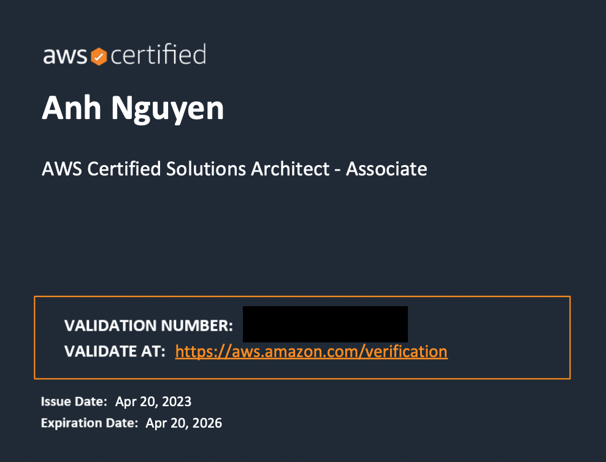

## Summary

22-04-2023 I received AWS SAA-C03 certificated, so I write this post to share my knowledge

## Getting Started

I studied [course](https://www.udemy.com/course/aws-certified-solutions-architect-associate-saa-c03/)

After completed course, I tried to practice with 2 mock-exam courses:

1. [Practice Exams by Stephane Maarek](https://www.udemy.com/course/practice-exams-aws-certified-solutions-architect-associate/)

2. [Practice Exams by Neal Davis](https://www.udemy.com/course/aws-certified-solutions-architect-associate-practice-tests-k/)

You should review wrong questions after practice. When you got 80%, you can register and ready to get certificated

I think the real exam can easier than the practice exams

## Results

