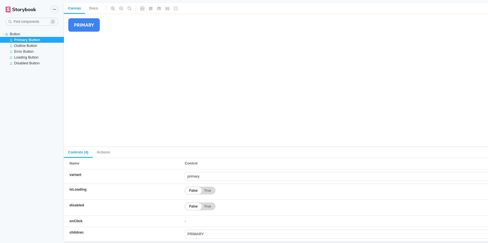

## Summary

In this post I will show you how we can build react components package

## Getting started

Setting dependencies

- [NodeJs](https://nodejs.org/en/)

## Solution

1. Go to working directory & Init project

```bash
cd ~/ && mkdir hugo-rc
npm init -y
yarn add react react-dom classnames
yarn add -D typescript tailwindcss postcss autoprefixer
npx sb init
```

Add tsconfig.json

```bash
npx tsc --init
```

```json
{
  "compilerOptions": {
    "target": "es5",
    "jsx": "react-jsx",
    "module": "commonjs",
    "rootDir": "./src",
    "declaration": true,
    "outDir": "./dist",
    "removeComments": true,
    "esModuleInterop": true,
    "forceConsistentCasingInFileNames": true,
    "strict": true,
    "skipLibCheck": true
  },
  "include": ["src"],
  "exclude": ["**/*.spec.{tsx,ts}", "**/*.stories.{tsx,mdx}", "node_modules"]
}
```

Add tailwind.css

```css
@tailwind base;
@tailwind components;
@tailwind utilities;
```

Update scripts

```json
"scripts": {
  "storybook": "start-storybook -p 6006",
  "build-storybook": "build-storybook",
  "prebuild": "rm -rf dist",
  "build": "npm run build:css && tsc",
  "prebuild:css": "rm -rf tailwind.generated.css",
  "build:css": "tailwindcss -i tailwind.css -o tailwind.generated.css"
}
```

Build tailwind.generated.css

```bash
yarn build:css
```

import css to storybook
```js
// .storybook/preview.js

import '../tailwind.generated.css';

export const parameters = {
  actions: { argTypesRegex: '^on[A-Z].*' },
  controls: {
    matchers: {
      color: /(background|color)$/i,
      date: /Date$/,
    },
  },
};
```

2. Write react components

```ts
// src/components/button.tsx
import React, { forwardRef, ComponentPropsWithoutRef } from 'react';
import cn from 'classnames';
import { Spinner } from './Spinner';

export interface IButtonProps extends ComponentPropsWithoutRef<'button'> {
  className?: string;
  variant?: 'primary' | 'outline' | 'error';
  isLoading?: boolean;
  disabled?: boolean;
  onClick?: () => void;
}

export const Button = forwardRef<HTMLButtonElement, IButtonProps>(
  (
    {
      className,
      variant = 'primary',
      isLoading = false,
      disabled = false,
      onClick,
      children,
    }: IButtonProps,
    ref
  ) => {
    return (
      <button
        className={cn(
          'rounded-lg px-5 py-3 font-bold flex items-center justify-center focus:outline-none transition ease-in-out duration-150',
          disabled
            ? 'cursor-not-allowed bg-gray-500 hover:bg-gray-500 text-white'
            : [
                variant === 'error' &&
                  'bg-red-500 hover:bg-red-600 text-white border-white',
                variant === 'outline' &&
                  'bg-white text-blue-500 border border-blue-500',
                variant === 'primary' &&
                  'bg-blue-500 hover:bg-blue-600 text-white border-white',
              ],
          className
        )}
        onClick={onClick}
        disabled={disabled}
        type="button"
        ref={ref}
      >
        {isLoading ? (
          <Spinner
            className={
              variant === 'outline' ? 'border-blue-500' : 'border-white'
            }
          />
        ) : (
          <>{children}</>
        )}
      </button>
    );
  }
);
```

3. write storybook

```tsx
import React from 'react';
import { ComponentStory } from '@storybook/react';
import { Button } from './Button';

export default {
  title: 'Button',
  component: Button,
};

const Template: ComponentStory<typeof Button> = (args: any) => (
  <Button {...args}>{args.children}</Button>
);

export const PrimaryButton = Template.bind({});
PrimaryButton.args = {
  variant: 'primary',
  isLoading: false,
  disabled: false,
  onClick: () => {
    console.log('click primary button');
  },
  children: 'PRIMARY',
};

export const OutlineButton = Template.bind({});
OutlineButton.args = {
  variant: 'outline',
  isLoading: false,
  disabled: false,
  children: 'OUTLINE',
};

export const ErrorButton = Template.bind({});
ErrorButton.args = {
  variant: 'error',
  isLoading: false,
  disabled: false,
  children: 'ERROR',
};

export const LoadingButton = Template.bind({});
LoadingButton.args = {
  variant: 'primary',
  isLoading: true,
  disabled: false,
  children: 'LOADING',
};

export const DisabledButton = Template.bind({});
DisabledButton.args = {
  variant: 'primary',
  disabled: true,
  isLoading: false,
  onClick: () => {
    console.log('click disabled button');
  },
  children: 'DISABLED',
};
```

4. Preview storybook

```bash
yarn storybook
```



5. Setting to publish package

add .npmignore

```
package.json
src
tsconfig.json
dist
```

6. Run command to publish

```bash
npm publish
```

7. Deploy to netlify

Preview [site](https://hugo-rc.netlify.app/)
