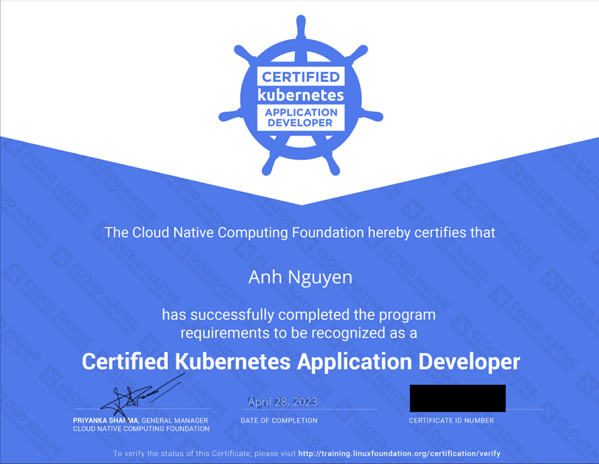

## Summary

28-04-2023 I received Certified Kubernetes Application Developer (CKAD), so I write this post to share my knowledge

## Getting Started

I studied [course](https://www.udemy.com/course/certified-kubernetes-application-developer/). This course contains knowledge for the exam and provide the lab to practice 

After completed course, I tried to practice with the mock-exam course:

[Practice Exams by KodeKloud](https://kodekloud.com/courses/ultimate-certified-kubernetes-application-developer-ckad-mock-exam-series/)

This course is very similar the real test. After practice the exam course, I think you can get the certificated

## Results

