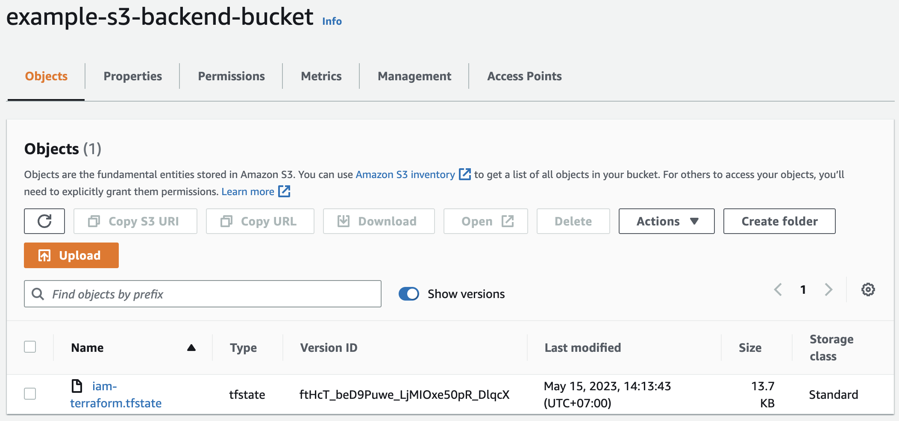
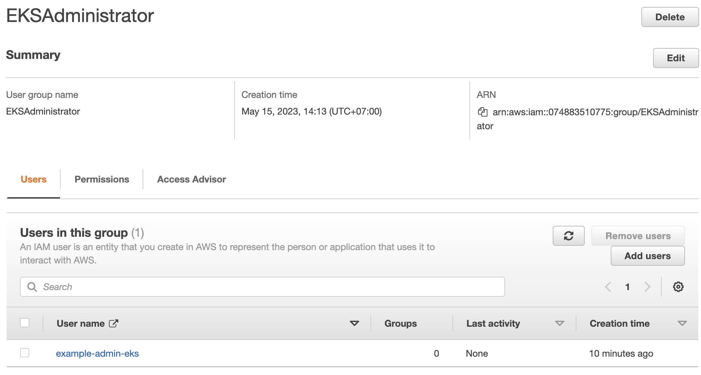
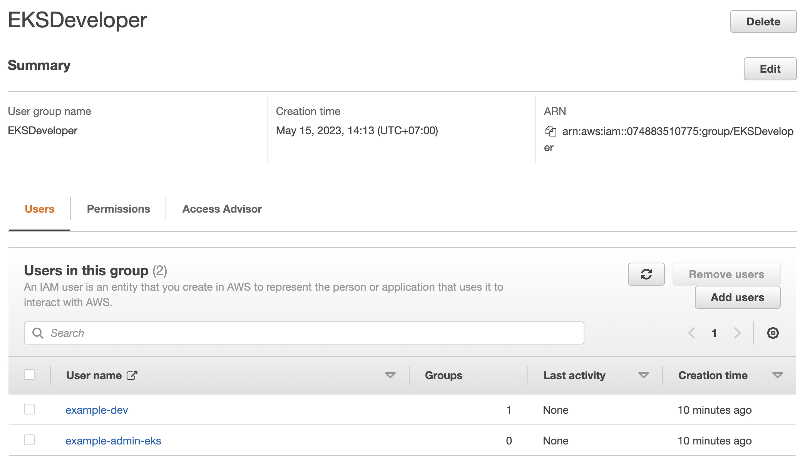

## Tổng quan

Một ngày đẹp trời mình nhận được tin nhắn từ sếp: *"team devops công ty bận quá nên nhờ chú set up infra cho con project_A. Mục tiêu là set up EKS tương tự như project_B vì stack cũng giống và cũng chia microservice"*

Nhiệm vụ của mình gồm:

- deploy EKS cluster bằng terraform
- deploy example application lên cụm EKS cluster
- triển khai CI CD để deploy application lên cụm EKS

Sau khi hoàn thành thì mình viết post này để chia sẻ lại quá trình xử lý task cũng như sai lầm đã mắc phải.

## Local set up

Ở local mình sẽ cần cài đặt 1 vài tools sau. Do quá trình cài đặt các tools này cũng đơn giản nên mình sẽ skip.

- aws-cli
- aws-iam-authenticator
- terraform
- kubectl
- helm
- eks-ctl

## Triển khai

### Việc đầu tiên và quan trọng nhất là deploy EKS cluster bằng terraform

Mình chưa làm việc với terraform trước đây nên vừa học vừa làm. Mình search thấy [document](https://learn.hashicorp.com/tutorials/terraform/eks) trên trang chủ của hashicorp(bên tạo ra terraform) nên như bắt được vàng. Mình tạo ngày 1 cụm eks-dev để test và nó lên luôn.

Một ngày nọ, ông anh cùng team bảo sao anh làm theo README của chú mà không work ở local của anh nhỉ? Trong khi ở máy của mình vẫn ngon. Sau khi tìm hiểu mình phát hiện ra bài post của hashicorp rất cơ bản nên mình gặp phải vấn đề nghiêm trọng khi quản lý terraform state.

Mặc định terraform state sẽ lưu trữ ở local và không push nó lên github. Nên ông anh làm cùng chịu chết vì state ở local của ông ấy làm gì giống local của mình. Mình tìm hiểu terraform backend với s3 để quản lý terraform state. Về terraform backend thì về sau mình thấy nó là một kiến thức cơ bản trong terraform nên mình sẽ không đề cập sâu trong bài này. Các bạn có thể xem chi tiết ở [đây](https://developer.hashicorp.com/terraform/language/settings/backends/configuration).

Sai lầm tiếp theo mà mình gặp phải là không phân quyền nên tất cả các dev trong dự án có quyền access vào cluster là như nhau nên có 1 ông dev tò mò đã update 1 vài config của con AWS LoadBalancer Controller dẫn đến routing bị lỗi. Mình quyết định phân quyền cho cụm K8S với 2 role cơ bản:

- Developer -> dành cho đội dev
- Administrator -> dành cho đội devops

với role Developer đội dev chỉ có quyền access vào namespace default, nơi sẽ triển khai các business application.

Folder structure của mình:

```
├── eks-terraform
│   ├── .terraform-version
│   ├── variables.tf
│   ├── eks.tf
│   ├── main.tf
│   ├── vpc.tf
├── iam-terraform
│   ├── .terraform-version
│   ├── group.tf
│   ├── main.tf
│   ├── role.tf
│   ├── users.yaml
│   ├── variables.tf
├── kustomize
│   ├── argocd
│   ├── aws-load-balancer-controller
│   ├── ...
├── s3-backend
│   ├── s3.tf
│   ├── dynamodb.tf
│   ├── main.tf
│   ├── variables.tf
└── .gitignore
└── README.md
```

- eks-terraform là nơi mình sẽ lưu tf code để deploy EKS cluster
- iam-terraform là nơi mình deploy aws iam thông qua tf, cũng như cấp quyền cho user trong project
- kustomize là nơi lưu gitops config cho các k8s services
- s3-backend là nơi mình sẽ init terraform backend

### Khởi tạo s3-backend

Bạn có thể tham khảo s3-backend code của mình ở [đây](https://github.com/anhnt160190/eks-terraform-example/tree/main/s3-backend)

Thành phần của s3-backend khá đơn giản:

- s3.tf: set up s3 bucket để lưu terraform state
- dynamodb.tf: set up dynamodb để lock terraform state
- main.tf: định nghĩa provider và versions
- variables.tf: khai báo các variables để làm code dynamic hơn

Chạy các command sau để init s3-backend:

```bash
terraform init
terraform plan
terraform apply -auto-approve
```

Sau khi apply s3-backend thì mình đã có s3-bucket để save terraform state và dynamodb để lock state. Từ đây mình có thể quản lý các AWS resources thông qua terraform được rồi.

### Set up AWS IAM

Bạn có thể tham khảo iam-terraform code của mình ở [đây](https://github.com/anhnt160190/eks-terraform-example/tree/main/iam-terraform)

Thành phần của iam-terraform gồm:

- group.tf: set up iam group để group các user có cùng 1 nhóm permissions
- role.tf: set up iam role, ở bài toàn của mình để đơn giản mình khai báo 2 role dành cho dev và devops
- main.tf: định nghĩa provider và versions
- variables.tf: khai báo các variables để làm code dynamic hơn
- users.yaml: khai báo user và group của user(users nên được tạo trước ở 1 process khác)

Chạy các command sau để init iam-terraform:

```bash
terraform init
terraform plan
terraform apply -auto-approve
```

Sau khi apply iam-terraform

- ở s3-bucket bạn sẽ thấy 1 file terraform state của iam-terraform



- ở iam groups bạn sẽ thấy các iam user được add vào iam group




### Set up EKS

Bạn có thể tham khảo eks-terraform code của mình ở [đây](https://github.com/anhnt160190/eks-terraform-example/tree/main/eks-terraform)

Thành phần của eks-terraform gồm:

- eks.tf: set up cụm k8s
- vpc.tf: set up vpc
- main.tf: định nghĩa provider và versions
- variables.tf: khai báo các variables để làm code dynamic hơn

Ở dev mix giữa spot instance và on demand instance.

```tf
eks_managed_node_groups = {
  spot = {
    min_size       = 1
    max_size       = 3
    desired_size   = 1
    instance_types = ["m5.large"]
    capacity_type  = "SPOT"
  }
  on_demand = {
    min_size       = 1
    max_size       = 7
    desired_size   = 2
    instance_types = ["m5.large"]
    capacity_type  = "ON_DEMAND"
  }
}
```

Còn trên production thì mình mua reserved instance để save cost.

```tf
eks_managed_node_groups = {
  reserved = {
    min_size       = 3
    max_size       = 20
    desired_size   = 8
    instance_types = ["m5.large"]
  }
}
```

Chạy các command sau để apply eks-terraform:

```bash
terraform init
terraform plan
terraform apply -auto-approve
```

Từ đây ta có thể lấy file kube_config để access kubernetes từ local

```bash
aws eks update-kubeconfig --name eks-terraform-example
```

Verify

```bash
kubectl cluster-info
```

Đến đây thì sơ bộ làm cụm EKS đã được deploy hoàn thiện.

Việc tiếp theo cần làm:

- deploy argocd để triển khai gitops.
- deploy aws load balancer controller để expose k8s ingress
- set up circle ci pipeline để deploy service lên k8s thông qua gitops

Các bước này mình sẽ không đề cập ở post này và hẹn ở một ngày rảnh rỗi khác...
