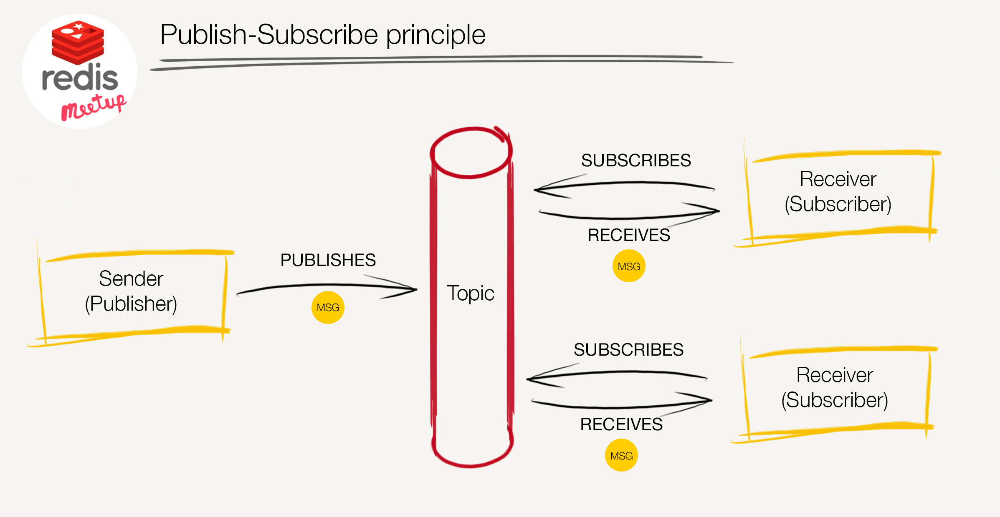
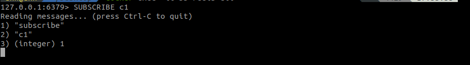
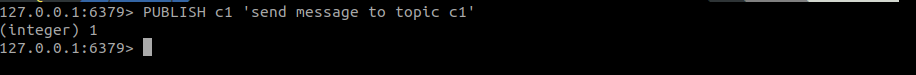
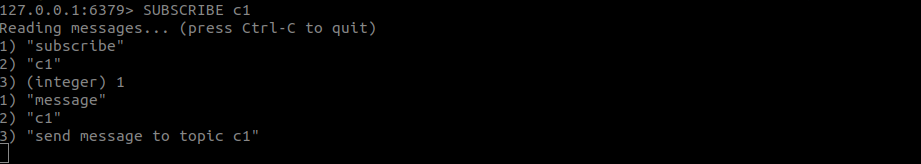

## Summary

In this post I will introduce to you about Redis PubSub.

## Pubsub Architecture


The above image is Redis Pubsub Architecture. We have Sender and Receiver are client which connect to Redis Server. Receiver will subcribe one Topic. Sender publish message to Topic, Receiver will receive this message.

## Example

You can check Redis Pubsub by open 2 client connect to Redis and follow command bellow

Start subcribe topic follow syntax bellow

```
> SUBSCRIBE ${TOPIC_NAME}
```

START send message to topic follow syntax bellow

```
> PUBLISH ${TOPIC_NAME} ${MESSAGE}
```

The results:







## Practical

When you want to scale up realtime application, you can use pubsub architecture.

This image bellow is sample chat application architecture.  


