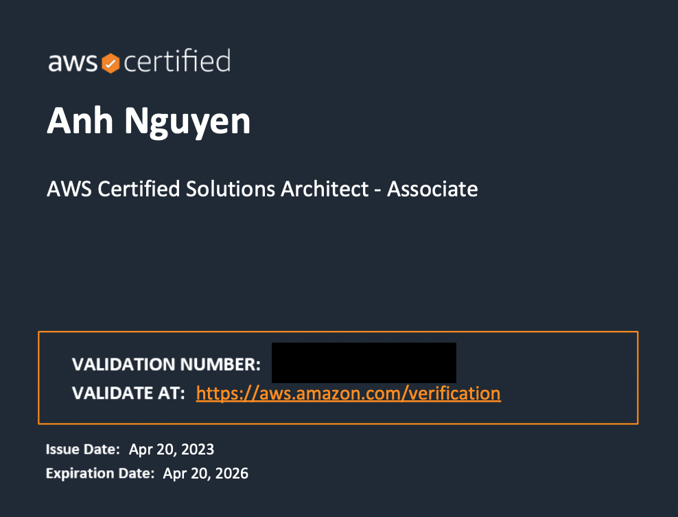

## Tổng quan

Tháng 3 năm 2022 mình nhận làm freelancer với role Senior Devops cho 1 công ty Fintech của Úc. Hồi đấy mình cũng chưa biết gì về AWS cả nhưng do cơm áo gạo tiền mình đã tự học AWS trên Udemy.
Ngày 21 tháng 4 năm 2023 sau một năm làm việc với AWS. Mình quyết định thi chứng chỉ AWS để trông mình có vẻ nguy hiểm hơn =))

### Về quá trình học tập

Mình bắt đầu từ số 0 và suất phát điểm là 1 Dev nên mình tiếp cận khoá [AWS Develop](https://www.udemy.com/course/aws-certified-developer-associate-dva-c01/) của Stephane Maarek

Sau khoá học này mình cũng tiếp cận được kha khá services của AWS nhưng cũng chỉ dừng lại ở lý thuyết.

Trong thời gian làm việc để bổ sung thêm kiến thức, mình học thêm khoá [AWS Solution Architect](https://www.udemy.com/course/aws-certified-solutions-architect-associate-saa-c03/) của Stephane Maarek.

Ở khoá này do mình đã có kinh nghiệm vs AWS rồi nên mình học khá nhàn.

Mình đặt KPI mỗi ngày 1 mục. Nên sau khoảng 2 tuần mình đã hoàn thành course.

Đúng đợt này công ty mình có đợt review lương, mình quyết định đi thi chứng chỉ cho nó oai =)) cũng như cho giống role mình đang làm một chút.

Ngày 17-04-2023 mình quyết định sẽ đi thi sau nhiều lần đắn đo.

Để chuẩn bị thi mình mua 2 khoá mock-exam:

1. [Practice Exams by Stephane Maarek](https://www.udemy.com/course/practice-exams-aws-certified-solutions-architect-associate/)

2. [Practice Exams by Neal Davis](https://www.udemy.com/course/aws-certified-solutions-architect-associate-practice-tests-k/)

Mình làm và review lại những câu sai cho đến khi kết quả >= 80 %

Đến ngày 21-04-2023 mình đi thi. Mình làm bài hết khoảng 70' thì xong.

Do thi chiều nên đến tận chiều 22-04-2023 mình mới nhận được kết quả.

Và đây là thành quả của mình:
