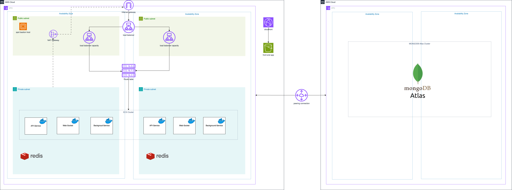

## Tổng Quan

Gần đây mình nhận kha khá yêu cầu về việc triển khai 1 số lượng services/applications lên môi trường production với AWS. Số lượng services lại không đủ nhiều để dùng đến mấy con hàng xịn sò như K8S. Nhưng yêu cầu là dễ dàng scale. Cân nhắc thì mình thấy ECS khá là phù hợp. Triển khai nhanh gọn với docker image. Quản lý version cũng dễ, scale cũng đơn giản. Thế nên trong bài post này mình chia sẻ lại quá trình mình triển khai 1 hệ thống lên AWS ECS.

## Tổng quan kiến trúc hệ thống

Bạn có thể tham khảo chi tiết hoặc chỉnh sửa lại với [draw.io](https://drive.google.com/file/d/1HMUh1GcFb7kLKzcrpXw5GpCoIx_3XE-O/view?usp=sharing)

Về cơ bản thì các applications/databases mình sẽ triển khai ở private subnets. Để expose applications, mình khởi tạo 1 load balancer ở public subnets.
Với các trường hợp cần access vào databases ở private subnets, mình triển khai thêm 1 bastion host ở public subnet. Để tối ưu chi phí thì với bastion host này mình sẽ dùng spot instance và chỉ bật lên khi sử dụng.

Vì bên mình sử dụng Mongo Atlas để host MongoDB. Mình sẽ khởi tạo 1 VPC peer connection từ AWS đến mongodb atlas để khởi tạo secure connection.
Đồng thời sử dụng IamRole để cho phép access vào MongoDB.

Với các trường hợp bạn dùng SQL database, bạn có thể sử dụng RDS của AWS luôn.

## Triển khai