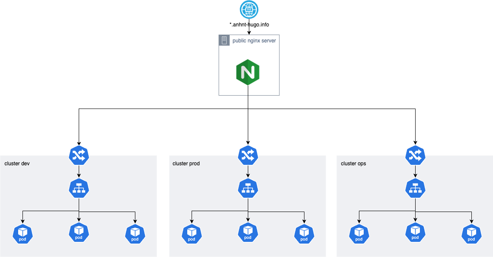
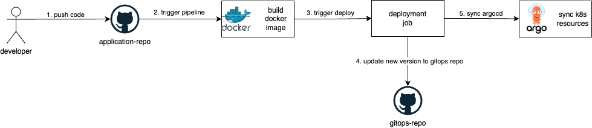

## Vấn đề

Tại phòng lab của công ty mình, chúng mình có rất nhiều các dự án nhỏ. Mục đích là nghiên cứu, test, và triển khai 1 vài products của công ty. Chúng mình có 1 lượng kha khá server vật lý để triển khai các sản phẩm từ dev-prod. Tuy nhiên khi triển khai như vậy thì phát sinh khá nhiều vấn đề về conflict giữa các team khi họ sử dụng chung kha khá servers.

Từ vấn đề trên sếp của mình đã đề xuất, yêu cầu triển khai on-premise K8S.

## Tổng quan

Do là phòng lab, bên mình chỉ triển khai 2 môi trường(dev và prod).

Mình chia hệ thống thành 3 cụm cluster.
- 1 cụm cluster cho dev
- 1 cụm cluster cho prod
- 1 cụm cluster cho ops team

Với mỗi product, các team sẽ được triển khai các applications, services của mình vào 1 vài k8s namespaces đã được phân quyền.

Mình dùng [k8s rbac](https://kubernetes.io/docs/reference/access-authn-authz/rbac/) để phân quyền cho các dev được quyền access vào k8s cluster.

Để triển khai deployment workflow, do bên mình đang sử dụng github nên mình dùng luôn github actions. Để tiện việc quản lý K8S applications, mình dùng ArgoCD.

Mỗi khi 1 dev push/merge 1 commit trên github. Github actions pipelines sẽ được trigger.
- job đầu tiên sẽ chạy unit test(cái này thì tuỳ team).
- sau khi test pass sẽ thực hiện build docker image và push lên docker registry.
- với branch develop sẽ trigger job deployment.
  + pull gitops repo
  + cập nhật image version mới vào gitops repo
  + push lên gitops repo
  + trigger sync argocd
  + argocd sync k8s manifest vào k8s cluster

TODO: monitoring

TODO: logging
